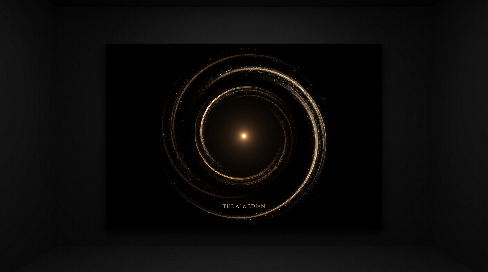
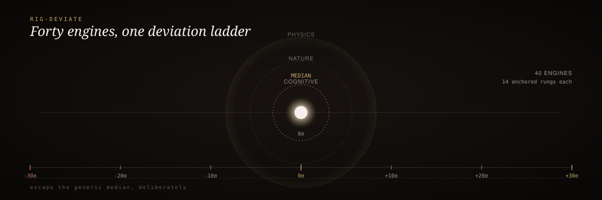

<div align="center">
<p align="center"></p>
  
</div>

<br/>

<div align="center">
  <h3>RIG Deviate</h3>
  <p><em>Push AI output past the generic median.</em></p>
</div>

<div align="center">


</div>

<br/>

> 🥇 Large language models are gravity wells. Ask for copy, code, strategy, or design and they collapse toward the polished, safe, forgettable median. `rig-deviate` fights that gravity with 40 named engines and a deterministic scorer for how far you actually moved.

## 60-second install

```bash
pip install rig-deviate
```

```python
from rig_deviate import deviate, score

seed = "Our product helps teams collaborate better."

result = deviate(seed, "GRAVITON", 10)   # push away from generic gravity
report = score(result)
print(report["rig_l"], report["rig_l_label"])
```

## How it works

<div align="center">
  
</div>

<sub align="center">seed → engine(σ) → deviated artifact → Robust-MAD-Z score → RIG-L grade</sub>

Every engine runs on a **±30σ ladder** with 14 anchored rungs — negative σ pulls *toward* the median, 0σ is the median, positive σ pushes *away* along that engine's axis. Cognitive and Nature engines operate on a soft ±20σ scale; Physics engines are hard ±30σ state gates, where the negative pole is a BLOCK, not a soft nudge.

```text
-30  -20  -10   -5   -3   -1    0   +1   +3   +5  +10  +20  +30
  |----|----|----|----|----|----|----|----|----|----|----|----|
negative pole              generic median              positive pole
```

## Results: the score system

`rig-deviate` uses **Robust-MAD-Z** instead of a normal z-score because the generic-LLM baseline is not Gaussian and is full of outliers:

```text
MAD = median(|x_i - median(x)|)
Robust-MAD-Z = 0.6745 * (score - median(baseline)) / max(MAD, 5.0)
```

Per-engine σ values combine into a composite **RIG-L** grade:

| RIG-L | σ range | Meaning |
| :-- | :-- | :-- |
| `block` | < 3σ | Still generic or unsafe |
| `marginal` | 3–5σ | Borderline |
| `review` | 5–10σ | Promising, needs human review |
| `promote` | 10–20σ | Strong deviation |
| **`doctrine_artifact`** | **≥ 20σ** | **Exceptional, civilization-grade output** |

## Why it exists

- **40 orthogonal lenses**, each tuned to a specific failure mode of generic output
- **Fully deterministic** — regex and arithmetic only, no network calls, no model inference, no API keys
- **CI-safe** — suitable for gates, pre-commit hooks, and automated evaluation pipelines
- **Measurable, not aesthetic** — every deviation ships with a Robust-MAD-Z score against a baseline corpus

<details>
<summary><strong>The 40 engines</strong></summary>

<br/>

| # | Codename | Layer | Full name | Positive pole |
|---|----------|-------|-----------|---------------|
| 1 | **GRAVITON** | Cognitive | Gravity Escape | surprising, category-defying, memorable |
| 2 | **ANCHOR** | Cognitive | Reality Anchor | evidence-dense, source-anchored |
| 3 | **DARWIN** | Cognitive | Evolutionary Selection | iterated, selected, pressure-tested |
| 4 | **XRAY** | Cognitive | Feynman X-Ray | precise, concrete, explainable to a novice |
| 5 | **FORGE** | Cognitive | Mechanism Furnace | mechanism-dense, causal, operational |
| 6 | **BREAKER** | Cognitive | Rupture Engine | contrarian, frame-breaking, orthogonal |
| 7 | **COLLIDER** | Cognitive | Collision Collider | cross-domain recombination |
| 8 | **VOLT** | Cognitive | Voltage Reactor | genuinely felt stakes, no coercion |
| 9 | **ECHO** | Cognitive | Memory Residue | sticky, quotable, durable recall |
| 10 | **HORIZON** | Cognitive | Temporal Horizon Integrity | optionality-rich, reversible bets |
| 11 | **SOVEREIGN** | Cognitive | Autonomy Calibration | agency-respecting, transparent |
| 12 | **SURPRISE** | Cognitive | Predictive Error Calibration | genuinely surprising yet coherent |
| 13 | **LOOP** | Cognitive | Zeigarnik Residue | curiosity loops, serialized intrigue |
| 14 | **VISCERA** | Cognitive | Somatic Marker | physically felt consequences |
| 15 | **REBOUND** | Cognitive | Opponent Process | dynamic contrast, earned resolution |
| 16 | **PRISM** | Cognitive | Signal-to-Noise Discriminability | sharp signal, clean structure |
| 17 | **WELLSPRING** | Cognitive | Hedonic Adaptation Resistance | layered, rewarding revisits |
| 18 | **GLYPH** | Cognitive | Kolmogorov Originality | incompressible, irreducible expression |
| 19 | **BAYES** | Cognitive | Confidence Calibration | appropriately uncertain, well-calibrated |
| 20 | **SHIELD** | Cognitive | Cognitive Sovereignty Shield | AI-augmented, human-gated judgment |
| 21 | **SWARM** | Nature | Pheromone Saturation | diverse, unexplored paths maintained |
| 22 | **ALBATROSS** | Nature | Lévy Flight | occasional long-range exploration |
| 23 | **SLIME** | Nature | Physarum Pruner | efficient, adaptive allocation |
| 24 | **CLONAL** | Nature | Immune Hypermutator | differential mutation by quality |
| 25 | **LUMINA** | Nature | Firefly Attractor | diverse attraction, controlled clustering |
| 26 | **COLI** | Nature | Chemotaxis Climber | gradient ascent with tumble fallback |
| 27 | **ROOT** | Nature | Mycorrhizal Allocator | fair, resilience-preserving allocation |
| 28 | **HUMPBACK** | Nature | Whale Spiral | annealed convergence |
| 29 | **CUCKOO** | Nature | Cuckoo Parasite | disruptive variants pruned or promoted |
| 30 | **REEF** | Nature | Coral Reef Evolver | maximal diversity with selection |
| 31 | **TUNNEL** | Physics | Quantum Tunneling | genuine orthodoxy penetration |
| 32 | **PAULI** | Physics | Pauli Exclusion | state-distinct identity |
| 33 | **CRITICAL** | Physics | Phase Transition | verified regime shift |
| 34 | **PARSEC** | Physics | Fine Tuning | cosmologically precise tuning |
| 35 | **HAWKING** | Physics | Hawking Radiation | information leakage / auditability |
| 36 | **CASIMIR** | Physics | Casimir Effect | deliberate absence produces value |
| 37 | **KELVIN** | Physics | Absolute Zero | honest bounded claims |
| 38 | **LUMEN** | Physics | Speed of Light | latency respects causal chain |
| 39 | **BELL** | Physics | Entanglement | genuine coupled-system effect |
| 40 | **ZEROPOINT** | Physics | Vacuum Fluctuation | healthy baseline variance present |

</details>

<details>
<summary><strong>Usage examples</strong></summary>

<br/>

**Apply every engine:**

```python
from rig_deviate import deviate_all

variants = deviate_all("Our product helps teams collaborate.", sigma=5)
for code, text in variants.items():
    print(f"{code}: {text}")
```

**Score an artifact:**

```python
from rig_deviate import score

report = score("Our product helps teams collaborate.")
print(report["rig_l"])        # composite σ
print(report["rig_l_label"])  # block | marginal | review | promote | doctrine_artifact
print(report["weakest_gate"]) # lowest-scoring engine
```

**Use a custom baseline:**

```python
from rig_deviate import score

baselines = {
    "GRAVITON": (40.0, 45.0, 48.0, 50.0, 52.0, 55.0, 58.0, 62.0, 65.0, 68.0),
}

report = score("...", baselines=baselines)
```

</details>

## Documentation

| Resource | Description |
| :-- | :-- |
| [CONTRIBUTING.md](CONTRIBUTING.md) | Contribution guide |
| [LICENSE](LICENSE) | MIT |

---

<div align="center"><sub>Built by Mike Rodgers · Forward Deployed Engineer · <a href="https://rodgersintelligence.com">rodgersintelligence.com</a></sub></div>
